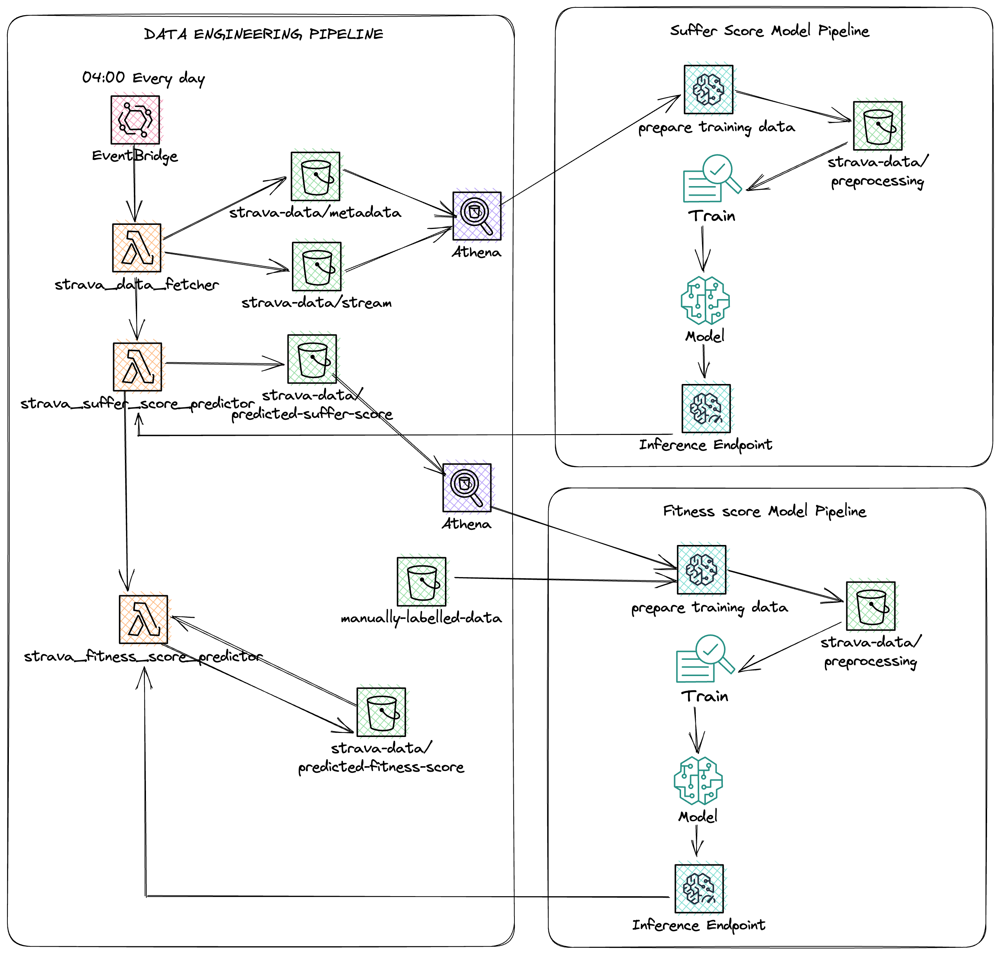

  

# Strava activities modelling

A dashboard for the metrics has been setup at [MLDev](https://mldev.herokuapp.com "MLDev")

This repo contains the code for the Strava activities modelling project. 
This is a demonstration in using an ML system as part of a larger system that does more than just predictions.  
In particular this is an attempt at implementing:
* A data ingestion pipeline
* An automatic ML training pipeline
* A deployment pipeline for the ML model
* CI/CD for the whole system
* Infrastructure as code for deploying various functional pieces and ML model deployment

Which go on to form a backend for a Web application that displays performance of a workout.

The project is divided into two parts:
* The first part is the data ingestion and processing which is located in the `engineering` folder.
* The second part is the machine learning modelling which is located in the `ml` folder.

Both parts are dockerized and can be run and deployed independently.

## ML part
For ML part there is a `Makefile` which contains the commands for building and deploying the docker ML image to ECR.  
Orchestrating the training and deployment of the ML model is done using  
AWS CDK `PipelineOrchestrationStack` and `ModelDeployerStack` stacks.

